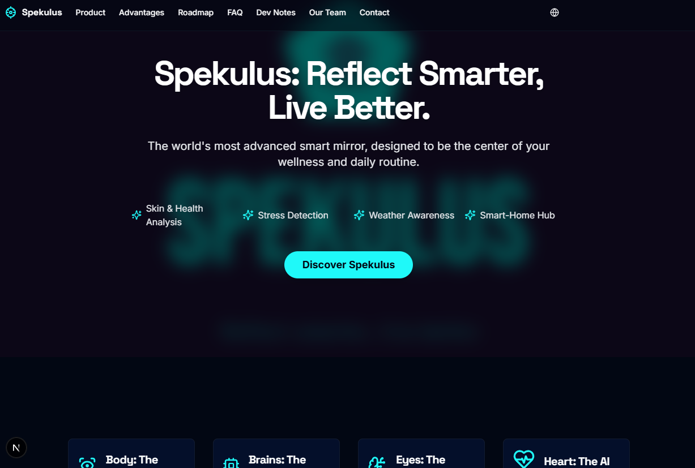

<div align="center">
  
  <h1 style="border-bottom: none; font-size: 2.5rem;"><strong>Spekulus</strong></h1>
  <p><strong>Reflect Smarter, Live Better.</strong></p>
  <p>The official informational website for the Spekulus smart mirror concept.</p>
</div>

<div align="center">

[](https://nextjs.org/)
[](https://react.dev/)
[](https://orm.drizzle.team/)
[](https://vercel.com/)

</div>

---

### **Welcome to the Spekulus Project! 👋**

Hello there! This repository contains the source code for the official marketing and informational website for **Spekulus**, a conceptual smart mirror designed to be the elegant centerpiece of your daily routine. We're excited to have you here.

## 💡 What is Spekulus?

Spekulus is more than just a mirror - it's a vision for a smarter way to live. It's an intelligent surface that provides personalized insights into your health, schedule, and environment without adding to your screen time.

**The Problem It Solves:** Our lives are cluttered with notifications and apps spread across multiple devices. Spekulus aims to centralize the essential information you need to start your day - skin analysis, stress levels, weather, and smart home controls - into a single, beautifully integrated device.

**Who It's For:**
- **Tech-Savvy Individuals:** People who love integrating smart technology into their homes.
- **Health & Wellness Enthusiasts:** Anyone looking for proactive ways to monitor their well-being.
- **Modern Homeowners:** Those who appreciate minimalist design and functional art.

---

## ✨ Key Features

This isn't just a static website. It's a fully dynamic, internationalized, and content-manageable platform.

*   **🌐 Multi-Language Support:** The entire site can be switched between **English**, **Ukrainian (Українська)**, and **Slovak (Slovenčina)**, with language preferences saved locally.
*   **🔐 Full-Fledged Admin Panel:** Almost every piece of text and every image on the public site can be edited through a secure, password-protected admin panel. No code changes needed for content updates!
*   **💾 Database-Driven Content:** All content is fetched from a Postgres database using **Drizzle ORM**, making the site fast, scalable, and easy to manage.
*   **🖥️ Responsive Design:** Built with Tailwind CSS and ShadCN UI, the site looks great on any device, from a large monitor to a mobile phone.

---

## 🚀 Getting Started

Ready to run the project locally? Here's how to get it up and running on your machine.

**1. Clone the repository:**
```bash
git clone https://github.com/Antot-12/Spekulus.git
cd Spekulus
```

**2. Install dependencies:**
This project uses `npm` for package management.
```bash
npm install
```

**3. Set up environment variables:**
Create a `.env` file in the root of the project by copying the example file:
```bash
cp .env.example .env
```
Now, fill in the `.env` file with your credentials:
```env
# Neon Serverless Postgres connection string
DATABASE_URL="postgres://..."

# Credentials for the admin panel login
ADMIN_USERNAME="your_admin_username"
ADMIN_PASSWORD="your_admin_password"

# (Optional) Resend API key for the contact form
RESEND_API_KEY="re_..."
```

**4. Push the database schema:**
This command reads your schema definition file (`/src/lib/db/schema.ts`) and creates the corresponding tables in your Neon database.
```bash
npm run db:push
```

**5. Seed the database:**
This command populates your new tables with the initial content (text, roadmap events, etc.) needed to run the site for the first time.
```bash
npm run db:seed
```

**6. Run the development server:**
You're all set! Start the development server to see the site in action.
```bash
npm run dev
```
The site will be available at `http://localhost:3000`.

---

## 🧠 How It Works

This project uses a modern web architecture that is both powerful and easy to develop with.

*   **Frontend**: The user interface is built with **Next.js** and **React**. Components are server-rendered by default, which means faster load times and better SEO.
*   **Data Flow**: Instead of traditional REST APIs, we use **Next.js Server Actions**. This allows the frontend to call secure, server-side functions directly, simplifying the process of reading from and writing to the database.
*   **Database**: All site content is stored in a **Neon Serverless Postgres** database. This makes the data easy to manage and update.
*   **ORM**: **Drizzle ORM** is used to communicate with the database. It provides a type-safe way to write database queries, which helps prevent bugs.

### The Admin Panel

The Admin Panel is the heart of the site's content management.

*   **Access**: You can access the login page at `/login`. Use the `ADMIN_USERNAME` and `ADMIN_PASSWORD` you set in your `.env` file.
*   **Functionality**: Once logged in, you can navigate to different sections (Hero, FAQ, Roadmap, etc.) and edit the content for all supported languages. The changes are saved directly to the database and are reflected on the public site immediately.

---

## 🛠️ Tech Stack

This project is built with a modern, powerful, and scalable tech stack.

*   **Framework:** [Next.js](https://nextjs.org/) (App Router)
*   **Styling:** [Tailwind CSS](https://tailwindcss.com/)
*   **UI Components:** [ShadCN UI](https://ui.shadcn.com/)
*   **Database ORM:** [Drizzle ORM](https://orm.drizzle.team/)
*   **Database:** [Neon](https://neon.tech/) (Serverless Postgres)
*   **Deployment:** [Vercel](https://vercel.com/)

---

## 📸 Screenshots


| Homepage                                    | Admin Panel                                  |
| ------------------------------------------- | -------------------------------------------- |
|  |  |

---

## 🤝 Contributing

We welcome contributions! Whether you want to fix a bug, add a feature, or improve the documentation, we'd love to see your pull request. Please feel free to open an issue to discuss your ideas first.

## 📄 License

This project is licensed under the MIT License. See the `LICENSE` file for more details.

---
<div align="center">
Made with ❤️ by the S&S Creation Team
</div>
