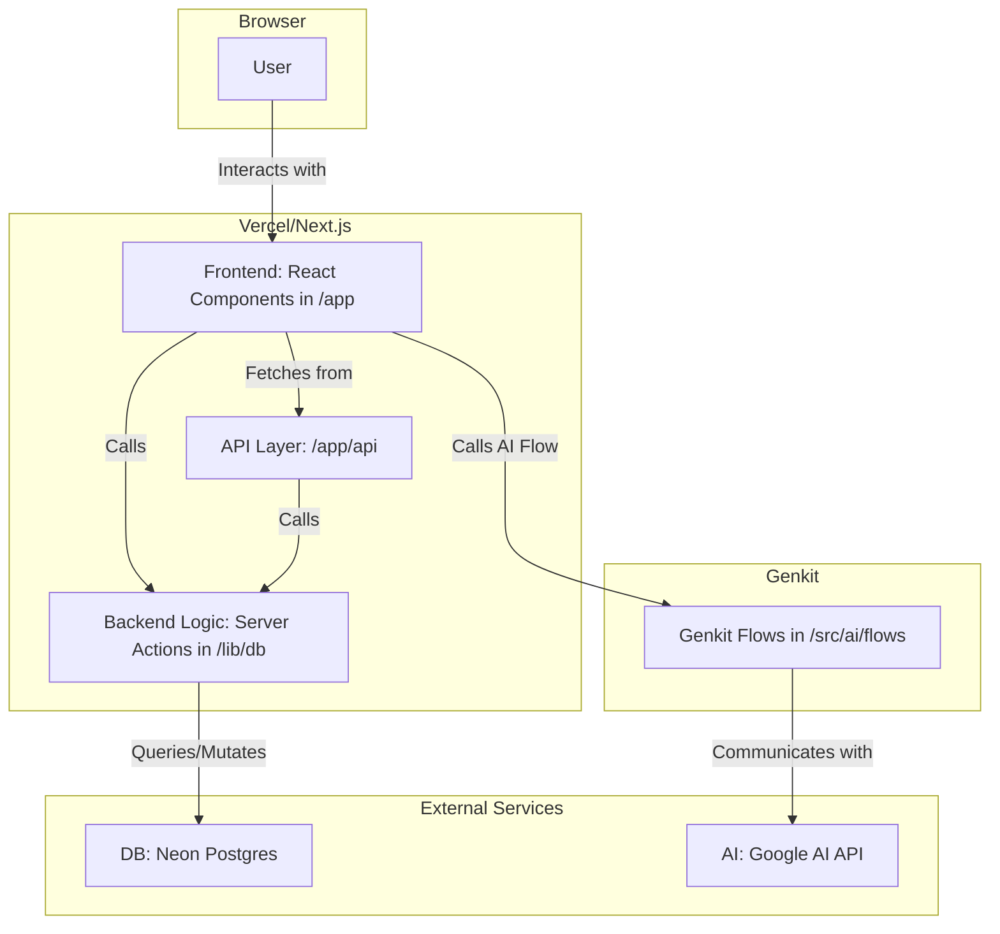

<div align="center">

---

# **S&S Creation**
## **Spekulus Site**

---

</div>

<br/>
<br/>

## Table of Contents

- **[1. Project Overview](#1-project-overview)**
- **[2. Developer Operations & Setup](#2-developer-operations--setup)**
  - [2.1. Environment Variables](#21-environment-variables)
  - [2.2. Database Management (Drizzle ORM)](#22-database-management-drizzle-orm)
  - [2.3. Running the AI (Genkit)](#23-running-the-ai-genkit)
- **[3. Project Structure](#3-project-structure)**
- **[4. Database Design & Schema](#4-database-design--schema)**
  - [Tables](#tables)
  - [Entity Relationships (ER Summary)](#entity-relationships-er-summary)
- **[5. Backend & Data Flow](#5-backend--data-flow)**
  - [5.1. Server Actions (`/src/lib/db/actions.ts`)](#51-server-actions-srclibdbactionsts)
  - [5.2. API Routes (`/src/app/api/`)](#52-api-routes-srcappapi)
- **[6. Admin Panel](#6-admin-panel)**
  - [6.1. Admin Panel Iconography](#61-admin-panel-iconography)
- **[7. AI Integration (Genkit)](#7-ai-integration-genkit)**
- **[8. Advanced Technical Documentation](#8-advanced-technical-documentation)**
  - [8.1. Project Architecture & Design Patterns](#81-project-architecture--design-patterns)
  - [8.2. Developer Workflow: Adding a "Testimonials" Section](#82-developer-workflow-adding-a-testimonials-section)
  - [8.3. Testing Strategy](#83-testing-strategy)
  - [8.4. Deployment Instructions](#84-deployment-instructions)
  - [8.5. Logs, Monitoring & Error Reporting](#85-logs-monitoring--error-reporting)
  - [8.6. Access Control & Security Notes](#86-access-control--security-notes)
  - [8.7. Internationalization (i18n) Guidelines](#87-internationalization-i18n-guidelines)
  - [8.8. Versioning, Branching, & Release Strategy](#88-versioning-branching--release-strategy)
  - [8.9. Contribution Guidelines](#89-contribution-guidelines)
- **[9. Glossary](#9-glossary)**
- **[10. Changelog & Versioning](#10-changelog--versioning)**
- **[11. Performance Optimization](#11-performance-optimization)**
- **[12. Accessibility (a11y) Guidelines](#12-accessibility-a11y-guidelines)**
- **[13. Asset & Image Handling](#13-asset--image-handling)**
- **[14. Rate Limiting & Anti-Spam](#14-rate-limiting--anti-spam)**
- **[15. Analytics & Telemetry](#15-analytics--telemetry)**
- **[16. Feature Flags](#16-feature-flags)**
- **[17. Known Issues & Limitations](#17-known-issues--limitations)**
- **[18. Tech Stack & Versions Summary](#18-tech-stack--versions-summary)**
- **[19. Architecture Diagram](#19-architecture-diagram)**
- **[20. Technical Roadmap (Planned Features)](#20-technical-roadmap-planned-features)**
- **[21. New Content Sections](#21-new-content-sections)**
  - [21.1. Scenarios ("Why Spekulus?")](#211-scenarios-why-spekulus)
  - [21.2. Competitor Comparison Table](#212-competitor-comparison-table)
  - [21.3. Partner / Investor CTA](#213-partner--investor-cta)
- **[22. Admin Panel Features](#22-admin-panel-features)**
  - [22.1. Admin Dashboard Link to Homepage](#221-admin-dashboard-link-to-homepage)
  - [22.2. Reusable File Picker](#222-reusable-file-picker)
  - [22.3. Collapsible Creator Profiles](#223-collapsible-creator-profiles)

---

## 1. Project Overview

Spekulus is a dynamic, multi-language marketing and informational website for a conceptual smart mirror product. The site is designed to be fully manageable through a custom admin panel, allowing content editors to update most public-facing content without requiring code changes.

This document serves as a complete technical guide for developers.

---

## 2. Developer Operations & Setup

### 2.1. Environment Variables

Create a `.env` file in the project root and define the following variables:

```env
# Neon Serverless Postgres connection string
DATABASE_URL="postgres://..."

# Credentials for the admin panel login
ADMIN_USERNAME="your_admin_username"
ADMIN_PASSWORD="your_admin_password"

# (Optional) Resend API key for the contact form
RESEND_API_KEY="re_..."
```

### 2.2. Database Management (Drizzle ORM)

The project uses Drizzle ORM to manage the database schema and queries.

- **Push Schema Changes:** After modifying the schema in `/src/lib/db/schema.ts`, apply the changes to the database:
  ```bash
  npm run db:push
  ```
- **Seed Database:** To populate a new database with initial content from `/src/lib/data.ts`:
  ```bash
  npm run db:seed
  ```
- **Drizzle Studio:** To open a local GUI for browsing the database:
   ```bash
   npm run db:studio
   ```
- **Configuration:** The Drizzle Kit configuration is in `drizzle.config.ts`. It's crucial to add any new table names to the `tablesFilter` array to ensure they are managed by Drizzle.

### 2.3. Running the AI (Genkit)

The AI flows run on a separate development server.

```bash
# Start the Genkit dev server
npm run genkit:dev

# Or run in watch mode
npm run genkit:watch
```
---

## 3. Project Structure

The project follows a standard Next.js App Router structure.

```
.
├── /drizzle/                # Drizzle ORM migration files (auto-generated)
├── /public/                 # Static assets (images, fonts, documents)
├── /src/
│   ├── /ai/                 # Genkit AI integration
│   │   ├── /flows/          # Genkit flows for specific AI tasks
│   │   └── genkit.ts        # Genkit initialization
│   ├── /app/                # Next.js App Router: pages and layouts
│   │   ├── /admin/          # Admin panel pages for content management
│   │   ├── /api/            # API route handlers (e.g., file serving)
│   │   ├── /creators/       # Public-facing pages for creators/team
│   │   ├── /dev-notes/      # Public-facing pages for dev notes
│   │   └── page.tsx         # Homepage component
│   │   └── layout.tsx       # Root layout for the entire application
│   ├── /components/         # Reusable React components
│   │   ├── /landing/        # Components specific to the homepage sections
│   │   ├── /ui/             # ShadCN UI components
│   │   └── ...              # Shared components (Header, Footer, etc.)
│   ├── /contexts/           # React Context providers (e.g., LanguageContext)
│   ├── /hooks/              # Custom React hooks (e.g., use-toast)
│   ├── /lib/                # Core logic, utilities, and data definitions
│   │   ├── /db/             # Database-related files
│   │   │   ├── actions.ts   # Server actions for all database CRUD operations
│   │   │   ├── schema.ts    # Drizzle ORM schema definitions
│   │   │   └── seed.ts      # Script to seed the database with initial data
│   │   ├── data.ts          # TypeScript types and initial data structures
│   │   ├── translations.ts  # Static text translations for different languages
│   │   └── utils.ts         # Utility functions
├── drizzle.config.ts        # Drizzle ORM configuration file
├── documentation.md         # This file
└── ...
```

- **Dynamic Routing:** The app uses folders with square brackets like `/creators/[slug]` to handle dynamic content pages. The slug is used to fetch specific data from the database.
- **Language Support:** Internationalization is managed via the `LanguageContext` and `translations.ts` file, allowing components to display text in the user-selected language.

---

## 4. Database Design & Schema

The schema is defined in `/src/lib/db/schema.ts` using Drizzle ORM.

### Tables

- **`languages`**: Stores the supported languages.
  - `code (varchar, PK)`: The 2-letter language code (e.g., 'en').
  - `name (text)`: The full language name (e.g., 'English').

- **`files`**: Stores all uploaded binary file data.
  - `id (serial, PK)`: Unique identifier for the file.
  - `data (bytea)`: The raw binary data of the file.
  - `filename (text)`, `mimeType (text)`, `createdAt (timestamp)`: Metadata.

- **`heroSections`**: Content for the main hero section of the homepage.
  - `lang (varchar, FK -> languages.code)`: Associates the content with a language.
  - `title, subtitle (text)`: The main heading and subheading.
  - `imageId (integer, FK -> files.id)`: The background image for the hero section.

- **`heroFeatures`**: The list of features displayed within the hero section.
  - `lang (varchar, FK -> languages.code)`: Language association.
  - `icon (text)`: The name of the Lucide React icon to display.
  - `text (text)`: The feature's description text.

- **`productComponents`**: The four "Anatomy" components on the homepage.
  - `lang (varchar, FK -> languages.code)`: Language association.
  - `icon, title, description (text)`: Content for each component.
  - `imageId (integer, FK -> files.id)`: The image for the component card.

- **`advantages`**: The key advantages/benefits listed on the homepage.
  - Fields are identical to `productComponents`.

- **`scenarios`**: The "Why Spekulus?" real-life scenarios.
  - `lang (varchar, FK -> languages.code)`: Language association.
  - `icon, question, answer (text)`: Content for each scenario card.

- **`comparisonSections`**: Stores the title and subtitle for the comparison section.
  - `lang (varchar, FK -> languages.code, unique)`: Associates the text with a language.
  - `title, subtitle (text)`: Editable text for the section header.

- **`competitorFeatures`**: The features for the competitor comparison table.
  - `lang (varchar, FK -> languages.code)`: Language association.
  - `feature (text)`: The name of the feature being compared.
  - `spekulus, himirror, simplehuman, mirrocool (boolean)`: Flags indicating support.

- **`partnerSections`**: The "Partner with Us" call-to-action section.
  - `lang (varchar, FK -> languages.code, unique)`: Language association.
  - `title, text, ctaLabel, ctaUrl (text)`: All text content for the section.
  - `imageId (integer, FK -> files.id)`: An optional accompanying image.

- **`actionSections`**: The "See in Action" section on the homepage.
  - `lang (varchar, FK -> languages.code, unique)`: Language association.
  - `title, subtitle, description, buttonText, buttonUrl (text)`: All text content.
  - `visible, buttonVisible (boolean)`: Toggles for visibility.
  - `imageId (integer, FK -> files.id)`: The main image for this section.

- **`roadmapEvents`**: Milestones for the public roadmap timeline.
  - `lang (varchar, FK -> languages.code)`: Language association.
  - `date (text)`: The date or quarter of the event (e.g., "2024-04-28" or "Q4 2025").
  - `title, description (text)`: Event details.

- **`faqItems`**: Questions and answers for the FAQ section.
  - `lang (varchar, FK -> languages.code)`: Language association.
  - `question, answer (text)`: The FAQ content.

- **`devNotes`**: Content for developer blog posts.
  - `id (serial, PK)`, `slug (text, unique)`: Unique identifiers for the note.
  - `date, title, summary, content, author (text)`: Core content of the note.
  - `tags (jsonb)`: An array of string tags (e.g., `['Backend', 'API']`).
  - `isVisible (boolean)`: Toggles public visibility.
  - `reactionCounts (jsonb)`: Stores reaction counts (e.g., `{'like': 10}`).
  - `imageId (integer, FK -> files.id)`: The header image for the note.

- **`creators`**: Profiles for team members.
  - `id (serial, PK)`, `slug (text, unique per lang)`: Unique identifiers.
  - `lang (varchar, FK -> languages.code)`: Language association.
  - All other fields (`name`, `role`, `bio`, etc.) are `text` or `jsonb` to store profile information. `jsonb` is used for arrays (skills, hobbies) and nested objects (socials, music).
  - `imageId, featuredProjectImageId (integer, FK -> files.id)`: Foreign keys for profile and project images.

- **`maintenanceSettings`**: A single-row table to control site-wide maintenance mode.
- **`pages`**: A table to control the status (active, hidden, maintenance) of individual site pages.

### Entity Relationships (ER Summary)

- **One-to-Many**: A `languages` record can be associated with many records in other tables (e.g., one 'en' language has many `faqItems`, `roadmapEvents`, etc.).
- **One-to-One**: Some tables like `heroSections`, `actionSections`, and `partnerSections` have a unique constraint on the `lang` key, creating a one-to-one relationship between a language and that section's content.
- **One-to-Many (Files)**: A `files` record can be referenced by many other records across different tables (`heroSections`, `creators`, etc.), but each content item (like a single creator profile) can only have one primary `imageId`.
- **Composite Keys**: The `creators` table uses a unique constraint on `(slug, lang)` to ensure that a creator's profile URL is unique for each language.

---

## 5. Backend & Data Flow

The application backend uses a hybrid approach:
1.  **Next.js Server Actions**: The primary method for data fetching and mutations. These are server-side functions that can be called directly from client components, simplifying data flow and eliminating the need for most traditional API endpoints.
2.  **API Routes**: A small number of traditional RESTful API routes are used for specific tasks like file handling and authentication where a dedicated endpoint is more suitable.

### 5.1. Server Actions (`/src/lib/db/actions.ts`)

These functions execute securely on the server and are the main bridge between the client and the database.

- **`get...` functions (READ)**:
  - e.g., `getHeroData(lang)`, `getCreators(lang)`, `getDevNoteBySlug(slug)`.
  - These functions query the database using Drizzle and return the requested data. They are called from page components (server-side) or client components (`useEffect`) to fetch initial data.

- **`update...` functions (UPDATE)**:
  - e.g., `updateHeroData(lang, data)`, `updateCreators(lang, data)`.
  - These take a language and a data payload. They typically perform a "delete-and-replace" or `onConflictDoUpdate` operation to update records for a specific language. They are called from the admin panel pages.

- **`create...` functions (CREATE)**:
  - e.g., `createAdvantage(lang, data)`, `createFaq(lang, data)`.
  - These insert a new row into the database for a given language and return the newly created record.

- **`delete...` functions (DELETE)**:
  - e.g., `deleteDevNote(id)`.
  - These remove a specific record from the database by its ID.

- **File Handling**:
  - `uploadFile(fileBuffer, filename, mimeType)`: Takes raw file data, inserts it into the `files` table, and returns the new file `id`.
  - `getFileData(id)`: Retrieves the raw file data and metadata from the `files` table based on its `id`.

### 5.2. API Routes (`/src/app/api/`)

A few traditional API routes exist for specific purposes where a standard HTTP endpoint is beneficial. The frontend communicates with these routes using the standard `fetch()` API. All routes return JSON responses with a `success: boolean` flag and an `error: string` message on failure.

---
#### **`GET /api/images/[id]`**
- **Purpose**: Serves raw file data from the database. This allows using a simple `` tag on the frontend for image files or creating download links for other file types.
- **Method**: `GET`
- **Parameters**:
  - `id` (URL path): The unique integer ID of the file to retrieve.
- **Success Response**:
  - `Status`: `200 OK`
  - `Body`: The raw binary data of the file.
  - `Headers`: `Content-Type`, `Content-Length`, `Cache-Control`.
- **Error Response**:
  - `Status`: `400 Bad Request` if the ID is invalid.
  - `Status`: `404 Not Found` if the file doesn't exist.
  - `Status`: `500 Internal Server Error` for database or other server issues.

---
#### **`POST /api/upload`**
- **Purpose**: Handles file uploads from the admin panel. It takes a file, calls the `uploadFile` server action to store it in the database, and returns the new file ID.
- **Method**: `POST`
- **Request Body**: `FormData` containing a single `file` field.
- **Success Response**:
  - `Status`: `200 OK`
  - `Body`: `{ "success": true, "id": <number> }`
- **Error Response**:
  - `Status`: `400 Bad Request` if no file is provided.
  - `Status`: `500 Internal Server Error` if the upload fails.
  - `Body`: `{ "success": false, "error": "<error_message>" }`

---
#### **`POST /api/auth/login`**
- **Purpose**: Validates admin credentials against environment variables. It's used exclusively by the `/login` page.
- **Method**: `POST`
- **Request Body**: JSON object `{ "username": "<string>", "password": "<string>" }`.
- **Success Response**:
  - `Status`: `200 OK`
  - `Body`: `{ "success": true, "user": { "username": "<string>" } }`
- **Error Response**:
  - `Status`: `400 Bad Request` for invalid input.
  - `Status`: `401 Unauthorized` for incorrect credentials.
  - `Status`: `500 Internal Server Error` for server configuration issues (e.g., missing ENV variables).
  - `Body`: `{ "success": false, "error": "<error_message>" }`

---
#### **`POST /api/contact`**
- **Purpose**: Handles submissions from the public contact form on the homepage. It validates the input and uses the Resend API to forward the message to a predefined email address.
- **Method**: `POST`
- **Request Body**: JSON object `{ "name": "<string>", "email": "<string>", "message": "<string>" }`.
- **Success Response**:
  - `Status`: `200 OK`
  - `Body`: `{ "success": true, "message": "Message sent successfully!" }`
- **Error Response**:
  - `Status`: `400 Bad Request` for invalid input (e.g., invalid email, message too short).
  - `Status`: `500 Internal Server Error` if the email fails to send or the server is misconfigured.
  - `Body`: `{ "success": false, "error": "<error_message>" }`

---

## 6. Admin Panel

The admin panel is a protected section for managing all dynamic site content.

- **Authentication**: Access is controlled via a simple client-side token.
  1. User logs in at `/login`.
  2. The `/api/auth/login` route verifies credentials.
  3. On success, the client sets `localStorage.setItem('admin_token', 'true')`.
  4. The root admin layout (`/src/app/admin/layout.tsx`) checks for this token on mount. If it's not present, it redirects the user to `/login`.
- **Structure**: Each page in `/app/admin/` (e.g., `/admin/faq`, `/admin/roadmap`) is a dedicated form for managing a specific content type.
- **Data Handling**: Admin pages are client components (`'use client'`).
  1. They use `useEffect` to fetch initial data for all languages using the server actions from `actions.ts`.
  2. A language switcher allows the admin to edit content for English, Ukrainian, or Slovak.
  3. When an admin makes a change (e.g., types in an input), the component's React state is updated.
  4. Clicking "Save" calls the corresponding `update...` server action, passing the current state to the server, which then writes it to the database.

### 6.1. Admin Panel Iconography

The admin panel uses icons from the `lucide-react` library to provide quick, intuitive visual cues for actions and navigation. All icons are SVGs, ensuring they are sharp at any resolution.

#### **Common Actions**

| Icon (Name) | Description & Functionality | Behavior Notes | Location |
| :--- | :--- | :--- | :--- |
| **`Save`** | Persists all changes made on the current page to the database. | The button is disabled while saving. | Top-right corner of most admin pages. |
| **`Loader2`** | A spinning indicator shown inside a button when an action (like saving or uploading) is in progress. | The button is disabled and the icon spins. | Replaces other icons inside buttons during processing. |
| **`PlusCircle`** | Adds a new item to a list (e.g., a new FAQ, a new roadmap event, a new creator profile). | Immediately adds a new, editable item to the UI. Requires saving to persist. | Top-right of list-based admin pages (FAQ, Roadmap, etc.). |
| **`Trash2`** | Deletes an item. | This action is often irreversible and placed inside a confirmation dialog to prevent accidental deletion. | Next to individual items in a list or form. |
| **`Upload` / `UploadCloud`** | Opens a file dialog to upload a file. | Triggers the browser's file selector. An `UploadCloud` is used for the main uploads page button. | Next to file input fields; main button on Uploads page. |
| **`Eye` / `EyeOff`** | Toggles the public visibility of an item (e.g., a dev note or creator profile). | The icon state changes on click to reflect the new visibility status. Requires saving. | Appears in visibility toggles on Notes and Creators pages. |
| **`Copy`** | Copies an item's ID or URL to the clipboard. | Displays a toast notification on success. | Appears in the Uploads manager. |
| **`LinkIcon`** | Copies an item's full public URL to the clipboard. | Displays a toast notification on success. | Appears in the Uploads manager. |
| **`Search`** | Indicates a search input field. | Purely decorative; placed inside the search input. | Appears on pages with search functionality (Logs, Uploads). |
| **`Expand`** | Opens a larger preview of an image. | Triggers a modal/dialog to show the image at a larger scale. | Appears on image cards in the Uploads manager. |

#### **Navigation & Layout**

| Icon (Name) | Description & Functionality | Behavior Notes | Location |
| :--- | :--- | :--- | :--- |
| **`LayoutDashboard`** | Navigates to the main admin dashboard. | Sidebar link. | Admin Sidebar |
| **`PanelLeft`** | Toggles the mobile sidebar navigation. | Appears only on smaller screens. | Top of the main content area on mobile. |
| **`LogOut`** | Logs the current user out of the admin panel. | Removes the auth token and redirects to the login page. | Bottom of the Admin Sidebar. |
| **`ChevronsLeft` / `ChevronLeft` / `ChevronRight` / `ChevronsRight`** | Used for pagination controls. | Navigates to the first, previous, next, or last page of items. Buttons are disabled when not applicable. | Bottom of paginated tables (Logs, Uploads). |
| **`LayoutGrid` / `List`** | Toggles between grid and list views for displaying items. | The active view's icon is highlighted. | Appears on the Uploads manager page. |
| **`ArrowUpDown`** | Indicates a sortable table column. | Clicking the header sorts the table by that column; the icon direction reflects the sort order. | Table headers on the Logs page. |

#### **Content-Specific Icons**

| Icon (Name) | Description & Functionality | Location |
| :--- | :--- | :--- |
| **`Home`** | Sidebar link to manage the Hero section. | Admin Sidebar, Dashboard |
| **`Cpu`** | Sidebar link to manage the Product "Anatomy" section. | Admin Sidebar, Dashboard |
| **`Sparkles`** | Sidebar link to manage the Advantages section. | Admin Sidebar, Dashboard |
| **`Camera`** | Sidebar link to manage the "In Action" or Gallery sections. | Admin Sidebar, Dashboard; Creators Page |
| **`Swords`** | Sidebar link to manage the Competitor Comparison table. | Admin Sidebar, Dashboard |
| **`MessageSquareQuote`** | Sidebar link to manage the Scenarios section. | Admin Sidebar, Dashboard |
| **`Handshake`** | Sidebar link to manage the Partner CTA section. | Admin Sidebar, Dashboard |
| **`MonitorPlay`** | Dashboard link to view the live homepage. | Admin Dashboard |
| **`FileText`** | Sidebar link to manage Dev Notes. | Admin Sidebar, Dashboard; Creators Page |
| **`Users`** | Sidebar link to manage Creator profiles. | Admin Sidebar, Dashboard; Creators Page |
| **`Calendar`** | Sidebar link to manage the Roadmap or date-related fields. | Admin Sidebar, Dashboard |
| **`HelpCircle`** | Sidebar link to manage the FAQ section. | Admin Sidebar, Dashboard |
| **`History`** | Sidebar link to navigates to the Action Logs page. | Admin Sidebar, Dashboard |
| **`Wrench`** | Sidebar link to navigates to the Maintenance page. | Admin Sidebar, Dashboard |
| **`Files`** | Sidebar link to navigates to the Pages Overview page. | Admin Sidebar, Dashboard |
| **`ImageIcon`** | A placeholder for where an image will appear. | Hero, Product, Action Section pages when no image is selected. |
| **`Music`** | Section icon for managing music/playlist information. | Creators Page |
| **`Briefcase`** | Section icon for managing featured project information. | Creators Page |
| **`GraduationCap`** | Section icon for managing education history. | Creators Page |
| **`Award`** | Section icon for managing certifications or achievements. | Creators Page |
| **`Heart`** | Section icon for managing personal details (hobbies, quotes). | Creators Page |

---

## 7. AI Integration (Genkit)

The project uses Genkit for its AI features.

- **Configuration**: The core Genkit setup is in `/src/ai/genkit.ts`, which configures the Google AI plugin.
- **Flows**: Specific AI tasks are defined as "flows" in `/src/ai/flows/`.
  - **`creator-chat-flow.ts`**: Powers the "Ask Me Anything" widget on creator profile pages. It takes a creator's bio, skills, and featured project along with a user's question, and prompts the LLM to answer in the first-person persona of the creator.
- **Usage**: These flows are exported as server actions and can be called directly from client components, just like the database actions.

---

## 8. Advanced Technical Documentation

### 8.1. Project Architecture & Design Patterns

- **Architectural Approach**: The project employs a **modular monolith** architecture. It's a single Next.js application, but it's organized with a strong separation of concerns to maintain clarity and scalability. The structure is feature-based within the `app` and `components` directories (e.g., `/admin/faq`, `/components/landing/FaqSection`).
- **Design Patterns**:
    - **Separation of Concerns**: UI components (`/components`), routing/pages (`/app`), business logic/database actions (`/lib/db/actions.ts`), and static definitions (`/lib/data.ts`) are kept in distinct directories.
    - **Service Layer (Data Access Layer)**: The `/src/lib/db/actions.ts` file acts as a service layer. It abstracts all database interactions, so UI components don't query the database directly. This makes the code easier to maintain and test.
    - **Reusable Components**: The project heavily relies on reusable React components, especially from ShadCN UI (`/components/ui`), which are composed to build complex UIs. This follows the DRY (Don't Repeat Yourself) principle.
- **System Interaction Flow**:
    1.  **Frontend (Next.js/React)**: The user interacts with a client component (e.g., an admin form).
    2.  **Server Action Call**: The component calls an async function from `actions.ts`. Because of the `'use server'` directive, Next.js treats this as a secure, server-only function call, not a typical API request.
    3.  **Database (Drizzle/Neon)**: The server action uses Drizzle ORM to build and execute a SQL query against the Neon Postgres database.
    4.  **AI (Genkit)**: For AI features, a component calls a flow from `/src/ai/flows/`. Genkit then communicates with the Google AI API and returns the result.

### 8.2. Developer Workflow: Adding a "Testimonials" Section

This example illustrates the end-to-end process for adding a new content section to the site.

1.  **DB Schema (`schema.ts`)**: Define a new `testimonials` table.
    ```typescript
    export const testimonials = pgTable('testimonials', {
      id: serial('id').primaryKey(),
      lang: varchar('lang', { length: 2 }).notNull().references(() => languages.code),
      author: text('author').notNull(),
      quote: text('quote').notNull(),
      imageId: integer('image_id').references(() => files.id),
    });
    ```
2.  **Drizzle Config (`drizzle.config.ts`)**: Add `'testimonials'` to the `tablesFilter` array.
3.  **Push to DB**: Run `npm run db:push` to apply the schema change.
4.  **Server Actions (`actions.ts`)**: Create `getTestimonials(lang)` and `updateTestimonials(lang, data)` functions to handle CRUD for the new table.
5.  **Data Types (`data.ts`)**: Define the `Testimonial` TypeScript type and add initial data to the `initialData` object for seeding.
6.  **Seed Script (`seed.ts`)**: Add logic to clear and seed the new `testimonials` table. Run `npm run db:seed` to populate the database.
7.  **Admin UI (`/admin/testimonials/page.tsx`)**: Create a new admin page (a client component) to manage testimonials. This page will use the new server actions. Add a link to it in the admin dashboard and sidebar.
8.  **Frontend Component (`/components/landing/TestimonialsSection.tsx`)**: Create the public-facing React component to display the testimonials.
9.  **Homepage (`/app/page.tsx`)**: Import and render the new `TestimonialsSection` component, fetching its data from the `getTestimonials` server action.

### 8.3. Testing Strategy

Currently, the project does not have an automated testing suite. This is a key area for future improvement.

- **Proposed Strategy**:
  - **Unit Tests (Vitest/Jest)**: For utility functions (`/lib/utils.ts`), translation helpers, and potentially individual server actions (with a mocked database).
  - **Integration Tests**: To test the interaction between server actions and the database schema. This could involve running tests against a separate, temporary database.
  - **End-to-End (E2E) Tests (Playwright/Cypress)**: To simulate user flows, such as logging into the admin panel, creating a new FAQ, and verifying it appears on the public site.
- **Setup Instructions (Future)**: A testing framework would be added to `package.json`. A `tests` directory would be created at the root, mirroring the `src` structure.

### 8.4. Deployment Instructions

- **Service**: The project is configured for easy deployment on **Vercel**, which is the recommended hosting provider for Next.js applications.
- **Process**:
    1.  Connect the GitHub repository to a new Vercel project.
    2.  Vercel will automatically detect that it is a Next.js project.
    3.  Add the required environment variables (`DATABASE_URL`, `ADMIN_USERNAME`, etc.) in the Vercel project settings.
    4.  Pushing to the `main` branch will trigger a production deployment. Pushing to any other branch will create a preview deployment.
- **Secrets Management**: All secrets (API keys, database URLs) must be stored as environment variables in the Vercel dashboard and never hard-coded.

### 8.5. Logs, Monitoring & Error Reporting

- **Logging**:
    - **Vercel Logs**: All `console.log`, `console.warn`, and `console.error` statements in server-side code (server actions, API routes) are automatically captured and can be viewed in the Vercel dashboard for both production and preview deployments.
    - **Admin Action Logs**: The application includes a custom logging solution for admin actions, visible on the `/admin/logs` page. It uses `localStorage` and is designed to provide a client-side audit trail for content editors.
- **Error Reporting**: No external error reporting service (like Sentry) is currently integrated. Errors are logged to the Vercel console.

### 8.6. Access Control & Security Notes

- **Admin Route Protection**: Access to the `/admin` section is controlled by a simple client-side check in `/src/app/admin/layout.tsx`. It looks for a specific key (`admin_token`) in `localStorage`.
- **Known Limitations & Future Improvements**:
    - **No Server-Side Session**: The current method is not a secure, server-enforced session. A malicious user could bypass this by manually setting the `localStorage` key.
    - **Improvement Plan**: Implement a proper authentication solution using JWTs (JSON Web Tokens) or a library like `NextAuth.js`. This would involve:
        1.  The `/api/auth/login` route returning a signed HTTP-only cookie.
        2.  Creating a middleware file (`middleware.ts`) to protect all `/admin/**` routes by verifying the cookie on the server for every request.
    - **CSRF Protection**: Standard form submissions are protected against Cross-Site Request Forgery by Next.js Server Actions.
    - **Secrets**: Ensure the `.env` file is never committed to version control.

### 8.7. Internationalization (i18n) Guidelines

- **Structure**: All static translations are stored in `/src/lib/translations.ts`. The structure is a nested object, first keyed by language code (`en`, `uk`, `sk`), then by page or component.
- **Adding New Translations**:
    1.  Add the new key-value pair to the `en` (English) object first.
    2.  Add the corresponding translations to the `uk` and `sk` objects.
    3.  Use the `useLanguage` hook in a client component to access the translations: `const { translations } = useLanguage();`.
- **Fallback Logic**: There is no automatic fallback. If a translation key is missing for a specific language, it will cause a runtime error. It is crucial to ensure all keys exist for all languages.

### 8.8. Versioning, Branching, & Release Strategy

- **Git Workflow**: The project uses a simple **GitHub Flow** model.
    1.  The `main` branch is always considered production-ready.
    2.  To work on a new feature or bugfix, create a new branch from `main` (e.g., `feature/add-testimonials` or `fix/login-error`).
    3.  Once work is complete, open a Pull Request (PR) against the `main` branch.
    4.  After code review and automated checks (if any) pass, the PR is merged into `main`, which triggers a new deployment.
- **Commit Messages**: Commits should follow the **Conventional Commits** specification (e.g., `feat: Add testimonials section`, `fix: Correct typo in footer`).
- **Versioning**: The project does not currently use semantic versioning tags, but this can be added in the future as the project matures.

### 8.9. Contribution Guidelines

- **Onboarding**:
    1.  Clone the repository.
    2.  Install dependencies with `npm install`.
    3.  Create a `.env` file and set the required variables (see Section 2.1).
    4.  Run the database seed script: `npm run db:seed`.
    5.  Start the development server: `npm run dev`.
- **Pull Request Checklist**:
    - [ ] Code is formatted (`npm run lint` if a linter is configured).
    - [ ] New features are documented in `documentation.md`.
    - [ ] The PR has a descriptive title and explains the "why" behind the changes.
    - [ ] (If applicable) Include screenshots or GIFs of UI changes.
- **Communication**: Project discussions happen in GitHub Issues and Pull Requests.

---

### 9. Glossary

- **a11y**: Abbreviation for "accessibility," referring to the practice of making websites usable by people with disabilities.
- **Flow**: A term from Genkit for an end-to-end AI function that can be called from the application (e.g., `creatorChatFlow`).
- **i18n**: Abbreviation for "internationalization," the process of designing software to be adapted to various languages and regions.
- **Payload**: The data sent in the body of an API request (e.g., the JSON object sent to `/api/auth/login`).
- **Seed**: The process of populating a database with initial, default data. The seed script is located at `/src/lib/db/seed.ts`.
- **Server Action**: A Next.js feature allowing server-side code to be executed directly from client components, without manually creating API endpoints.
- **Slug**: A URL-friendly string used as a unique identifier for a resource, such as `my-first-post` in `/dev-notes/my-first-post`.

### 10. Changelog & Versioning

- **Versioning Scheme**: The project should adopt **Semantic Versioning (SemVer)** `MAJOR.MINOR.PATCH` (e.g., `1.2.3`).
    - `MAJOR` version when you make incompatible API changes.
    - `MINOR` version when you add functionality in a backward-compatible manner.
    - `PATCH` version when you make backward-compatible bug fixes.
- **Changelog Format**: All changes should be documented in a `CHANGELOG.md` file (not yet created). Entries should be grouped by type, following the Conventional Commits specification.

- **Sample Release Changelog**:
  ```markdown
  ## [1.1.0] - 2024-08-01

  ### ✨ Features
  - **Admin**: Added a "Testimonials" section to the admin panel.
  - **API**: Implemented a new `/api/testimonials` endpoint.

  ### 🐛 Bug Fixes
  - **UI**: Corrected a layout issue in the footer on mobile devices.

  ### 📚 Documentation
  - Updated `documentation.md` with details on the new testimonials table.
  ```

### 11. Performance Optimization

- **Framework**: The use of Next.js with the App Router and Server Components by default minimizes the amount of JavaScript sent to the client, improving initial load times.
- **Images**: The `next/image` component is used for automatic image optimization (resizing, format conversion like WebP), but is not yet implemented everywhere. This is a key area for improvement.
- **Database**: Drizzle ORM is efficient, but complex queries should be benchmarked. Adding database indexes to frequently queried columns (like `slug` and `lang`) is critical for performance at scale.
- **Caching**: Vercel automatically caches static assets. API Routes use `Cache-Control` headers (e.g., `/api/images/[id]`) for efficient browser and CDN caching.

### 12. Accessibility (a11y) Guidelines

- **Semantic HTML**: Use appropriate HTML5 tags (`<main>`, `<nav>`, `<article>`, etc.) to provide structure for screen readers.
- **ARIA Attributes**: Use `aria-label` for icon-only buttons to provide a text description. The ShadCN UI components used in this project handle many ARIA attributes automatically.
- **Focus Management**: Ensure all interactive elements have clear `focus-visible` styles (the default blue ring). Custom components should maintain this behavior.
- **Keyboard Navigation**: All interactive elements should be reachable and operable via the keyboard.

### 13. Asset & Image Handling

- **Storage**: All uploaded files are stored in the `files` table in the database as `bytea` (binary data).
- **Serving**: Files are served via the `/api/images/[id]` route, which retrieves the binary data from the database.
- **Formats**: While the system accepts any file type, it's recommended to use optimized web formats like **WebP** for images and **PDF** for documents.
- **Naming**: File naming should be descriptive and use hyphens instead of spaces (e.g., `creator-profile-anton.webp`).

### 14. Rate Limiting & Anti-Spam

- **Current Status**: There is **no rate limiting or anti-spam protection** implemented on public endpoints like `/api/contact` or `/api/auth/login`.
- **Future Improvements**:
    - **Rate Limiting**: Implement a package like `rate-limiter-flexible` with a Redis or Postgres store to limit requests to sensitive endpoints.
    - **Anti-Spam**: For the contact form, integrate a service like Google reCAPTCHA or use a simple honeypot field to deter bots.

### 15. Analytics & Telemetry

- **Current Status**: No analytics or telemetry systems are currently integrated.
- **Future Plan**:
    - **Vercel Speed Insights & Analytics**: These can be enabled with one click in the Vercel dashboard to monitor Web Vitals and track page views, respecting user privacy.
    - **Google Analytics**: If more detailed event tracking is needed, a Google Analytics script could be added in the root `layout.tsx`, managed via a React Context or a third-party library to handle user consent (GDPR).

### 16. Feature Flags

- **Current Status**: There is no formal feature flag system in place.
- **Implementation**: Feature visibility is currently handled by simple boolean flags in the database (e.g., `isVisible` on `devNotes` or `creators` tables) or by commenting out components in the code.
- **Future Plan**: For more complex A/B testing or gradual rollouts, a dedicated feature flag service like LaunchDarkly, PostHog, or a custom solution using the database could be implemented.

### 17. Known Issues & Limitations

- **Admin Authentication**: The current admin auth is client-side only and not secure for production. (See "Access Control & Security Notes").
- **Missing Tests**: The lack of an automated testing suite increases the risk of regressions.
- **Translation Fallbacks**: There is no system to fall back to English if a translation key is missing for another language, which can cause runtime errors.
- **Image Optimization**: The project uses the raw `/api/images/[id]` endpoint, bypassing Next.js's powerful `next/image` optimization. This should be refactored.

### 18. Tech Stack & Versions Summary

- **Framework**: Next.js 15.3.3
- **Language**: TypeScript 5
- **Styling**: Tailwind CSS 3.4.1
- **UI Components**: ShadCN UI, Radix UI, Lucide React
- **Database**: Neon (Serverless Postgres)
- **ORM**: Drizzle ORM 0.32.0, Drizzle Kit 0.23.0
- **AI**: Genkit 1.13.0 with Google AI
- **Forms**: React Hook Form 7.54.2 with Zod 3.24.2 for validation
- **Deployment**: Vercel

### 19. Architecture Diagram

This diagram illustrates the high-level interaction between the different parts of the Spekulus application.



- **User**: Interacts with the React components.
- **Frontend**: Client and Server Components in `/app` render the UI. They call Server Actions or API Routes for data.
- **API Layer**: A few dedicated REST endpoints for tasks like file uploads and serving.
- **Backend Logic (Server Actions)**: The primary way the application communicates with the database. Contains all Drizzle ORM queries.
- **Database**: The Neon Postgres database, the single source of truth for all content.
- **Genkit/AI**: AI features are handled by Genkit flows, which communicate with the Google AI API.

### 20. Technical Roadmap (Planned Features)

This section tracks planned technical improvements, distinct from the public-facing product roadmap.

| Feature / Improvement | Status | Description |
| :--- | :--- | :--- |
| **Secure Admin Auth** | `Planned` | Replace the client-side `localStorage` token with secure, server-side session management (e.g., JWTs in HTTP-only cookies). |
| **Automated Testing Suite** | `Planned` | Implement Vitest for unit tests and Playwright for E2E tests to improve code quality and prevent regressions. |
| **Refactor to `next/image`** | `Planned` | Replace all `` tags pointing to `/api/images/[id]` with the `next/image` component to leverage automatic optimization. |
| **Admin Panel Autosave** | `Planned` | Add an optional autosave feature to admin forms to prevent data loss on long editing sessions. |
| **Image Resizing/Cropping** | `In Progress` | Allow admins to resize or crop images directly in the upload manager instead of requiring pre-sized images. |
| **i18n Fallback Logic** | `Planned` | Implement a system where missing translation strings automatically fall back to English to prevent errors. |
| **CI/CD Pipeline** | `Planned` | Set up a GitHub Actions workflow to run linting and tests automatically on every pull request. |

---

### 21. New Content Sections

This section details the homepage content sections that are fully manageable via the Admin Panel.

#### 21.1. Scenarios ("Why Spekulus?")
- **Purpose**: To explain real-world problems and show how Spekulus provides smart, practical solutions.
- **Homepage Component**: `WhySpekulusSection` (`/src/components/landing/WhySpekulusSection.tsx`)
- **Admin Page**: `/admin/scenarios`
- **Database Table**: `scenarios`
  ```typescript
  export const scenarios = pgTable('scenarios', {
      id: serial('id').primaryKey(),
      lang: varchar('lang', { length: 2 }).notNull().references(() => languages.code),
      icon: text('icon').notNull(),
      question: text('question').notNull(),
      answer: text('answer').notNull(),
  });
  ```
- **Functionality**: Admins can add, edit, and delete scenario cards for each language. Each scenario consists of an icon, a question (the problem), and an answer (the solution).

#### 21.2. Competitor Comparison Table
- **Purpose**: To transparently compare Spekulus's features against key competitors in the market.
- **Homepage Component**: `ComparisonSection` (`/src/components/landing/ComparisonSection.tsx`)
- **Admin Page**: `/admin/comparison`
- **Database Tables**:
  - `comparisonSections`: Stores the section's title and subtitle for each language.
    ```typescript
    export const comparisonSections = pgTable('comparison_sections', {
        id: serial('id').primaryKey(),
        lang: varchar('lang', { length: 2 }).notNull().references(() => languages.code).unique(),
        title: text('title').notNull(),
        subtitle: text('subtitle').notNull(),
    });
    ```
  - `competitorFeatures`: Stores the individual feature rows.
    ```typescript
    export const competitorFeatures = pgTable('competitor_features', {
        id: serial('id').primaryKey(),
        lang: varchar('lang', { length: 2 }).notNull().references(() => languages.code),
        feature: text('feature').notNull(),
        spekulus: boolean('spekulus').default(false).notNull(),
        himirror: boolean('himirror').default(false).notNull(),
        simplehuman: boolean('simplehuman').default(false).notNull(),
        mirrocool: boolean('mirrocool').default(false).notNull(),
    });
    ```
- **Functionality**: The admin panel at `/admin/comparison` allows full CRUD management of the features list and the section's text. Admins can:
  - Edit the section's main `title` and `subtitle`.
  - Add new feature rows.
  - Edit the `feature` description text for each row.
  - Toggle the boolean checkmarks for each product (`spekulus`, `himirror`, etc.).
  - Delete features.
  - The homepage table renders this data dynamically, showing check or cross icons based on the boolean values.

#### 21.3. Partner / Investor CTA
- **Purpose**: A call-to-action section to attract potential partners and investors.
- **Homepage Component**: `PartnerSection` (`/src/components/landing/PartnerSection.tsx`)
- **Admin Page**: `/admin/partner`
- **Database Table**: `partnerSections`
  ```typescript
  export const partnerSections = pgTable('partner_sections', {
      id: serial('id').primaryKey(),
      lang: varchar('lang', { length: 2 }).notNull().references(() => languages.code).unique(),
      title: text('title').notNull(),
      text: text('text').notNull(),
      ctaLabel: text('cta_label').notNull(),
      ctaUrl: text('cta_url'),
      imageId: integer('image_id').references(() => files.id, { onDelete: 'set null' }),
  });
  ```
- **Functionality**: A dedicated admin form allows editing the title, descriptive text, button label, and button URL for each language. It also includes an image uploader to add a visual element to the section.

---

### 22. Admin Panel Features

This section details specific UI/UX enhancements made to the admin panel for better usability.

#### 22.1. Admin Dashboard Link to Homepage
- **Location**: `/admin/dashboard`
- **Description**: The first card in the admin dashboard grid is "View Live Site". This provides a direct, one-click link to the public homepage (`/`).
- **Purpose**: This was added to improve the content editing workflow, allowing administrators to quickly navigate from the admin panel to the live site to see their changes in context.

#### 22.2. Reusable File Picker
- **Component**: `FilePickerDialog` (`/src/app/admin/creators/FilePickerDialog.tsx`)
- **Description**: A reusable dialog component that allows selecting a previously uploaded file from the `files` table instead of re-uploading it.
- **Functionality**: The picker dialog displays a searchable grid of all uploaded files. When a file is selected, its `id` is passed back to the parent form, which then updates the relevant `imageId` field. This is used across all content management pages where images are present (e.g., Hero, Creators, Notes).

#### 22.3. Collapsible Creator Profiles
- **Location**: `/admin/creators`
- **Description**: The creator management page was redesigned to use an `Accordion` component. Each creator profile is now a separate, collapsible item.
- **Purpose**: This change dramatically improves the organization of the page, preventing it from becoming an overwhelmingly long form. Editors can now focus on one creator at a time by expanding their specific accordion item. Each accordion trigger displays the creator's name and a badge indicating their visibility status ("Visible" or "Hidden").
